# **STS配置**

## 一、**配置P3C**

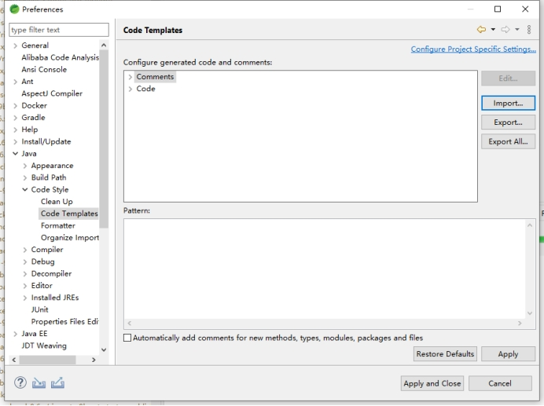

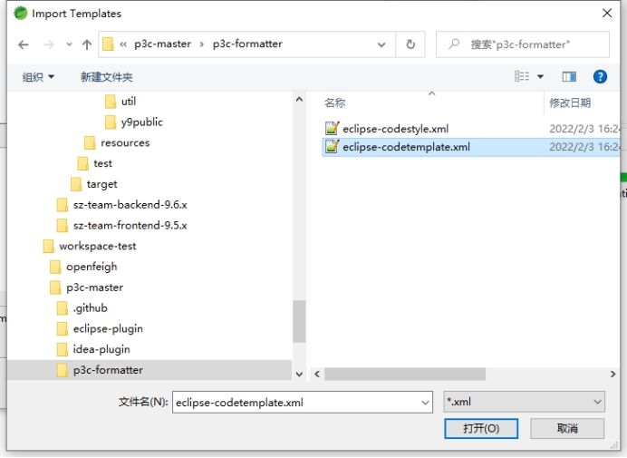

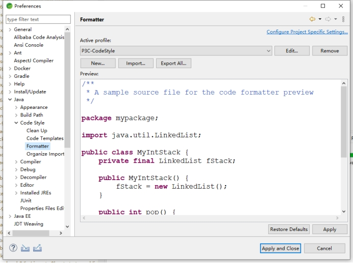

## 二、**配置import顺序**

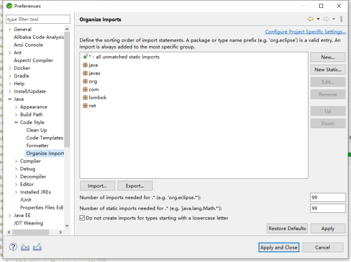

可通过Import导入，导入eclipse.importorder文件

## 三、**配置save actions**

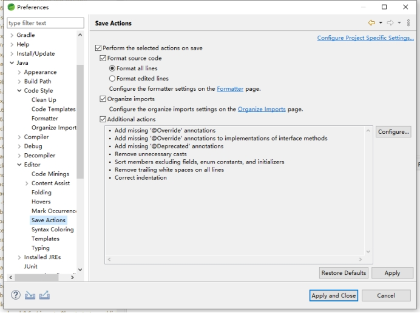

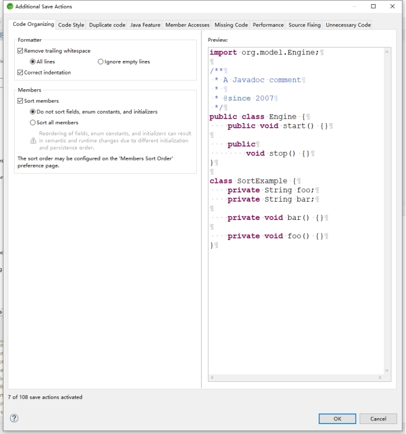

## 四、**配置Java每行的最大长度为120**

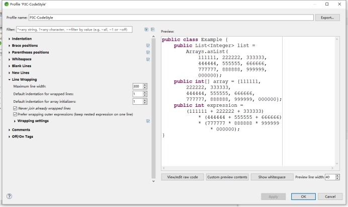

## 五、**配置代码validation**

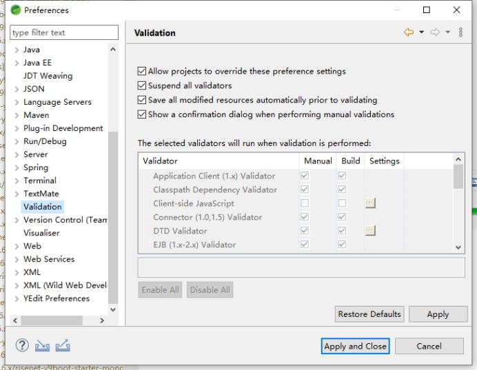

## **六、设置字符集**

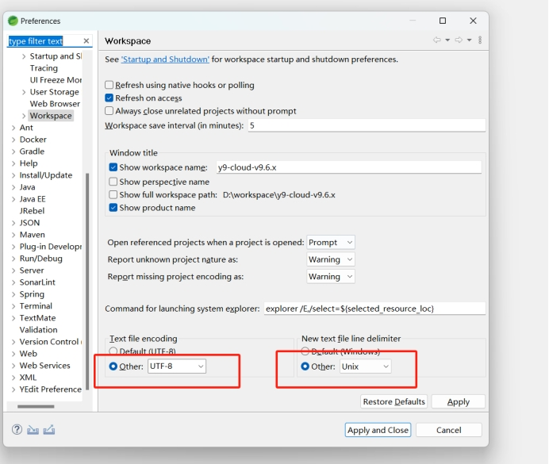

# **Intellij IDEA** **Community Edition设置**

## 一、**配置P3C和import顺序**

对于使用 Intellij IDEA Community Edition
的可以通过安装 [Adapter for Eclipse Code Formatter](https://plugins.jetbrains.com/plugin/6546-adapter-for-eclipse-code-formatter)
插件来使用 eclipse 的配置进行代码格式化，安装完成后重新启动

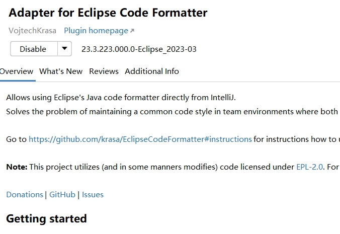

打开settings，如下设置，格式化文件在y9-digitalbase/style中可以找到

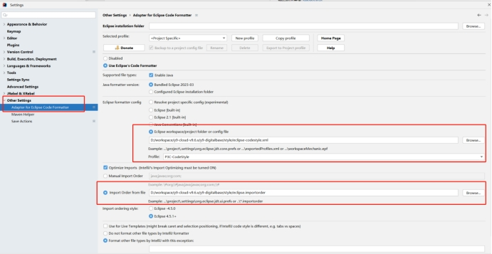

同时修改import类最大打开数，当大于这个数字的时候再用*号替换

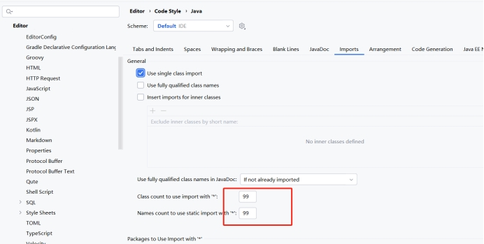

## 二、**配置save actions**

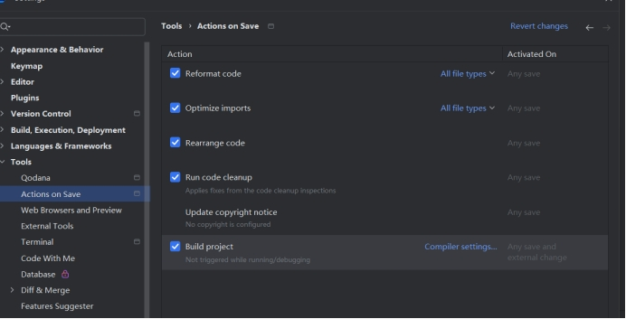

## **三、设置字符集**

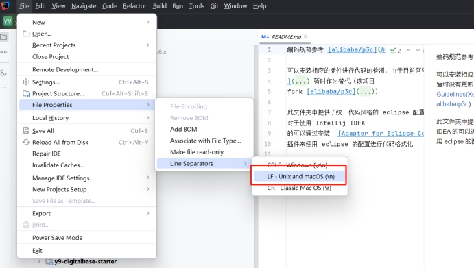 

 
